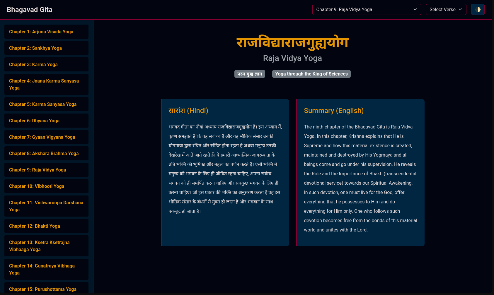
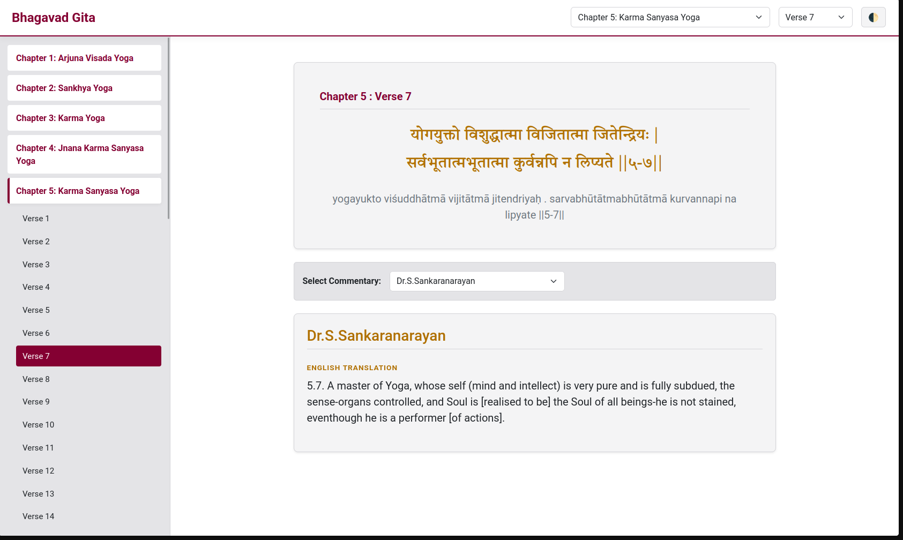

# Bhagavad Gita Reader

A clean, browser-based reader for the Bhagavad Gita with Sanskrit text, transliteration, and multi-author commentaries.

## Screenshots




## Features

- Browse all 18 chapters and their verses via a sidebar tree or top navigation dropdowns
- Read the original Sanskrit (Devanagari), transliteration, and English/Hindi chapter summaries
- Switch between multiple commentaries and translations for each verse
- Light/dark theme toggle

## Tech Stack

- Vanilla HTML, CSS, and JavaScript — no build step required
- [Bootstrap 5](https://getbootstrap.com/) for layout and UI components
- [Vedic Scriptures API](https://vedicscriptures.github.io) for chapter and verse data
- Google Fonts — *Tiro Devanagari Sanskrit* for the Sanskrit text

## Getting Started

Since the app fetches data from a public API, you just need to serve the files over HTTP (opening `index.html` directly via `file://` may cause CORS issues).

```bash
# Using Python
python -m http.server 8000

# Using Node.js (npx)
npx serve .
```

Then open `http://localhost:8000` in your browser.

## Project Structure

```
├── index.html   # App shell and markup
├── style.css    # CSS custom properties and component styles
└── script.js    # Data fetching and rendering logic
```
